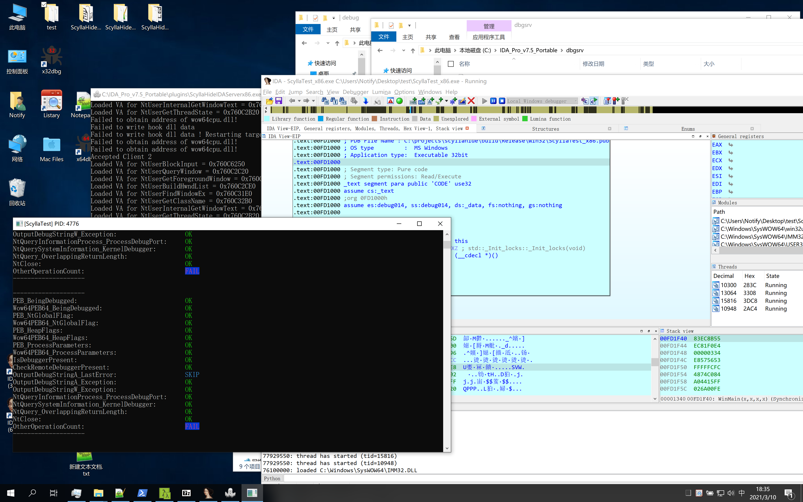
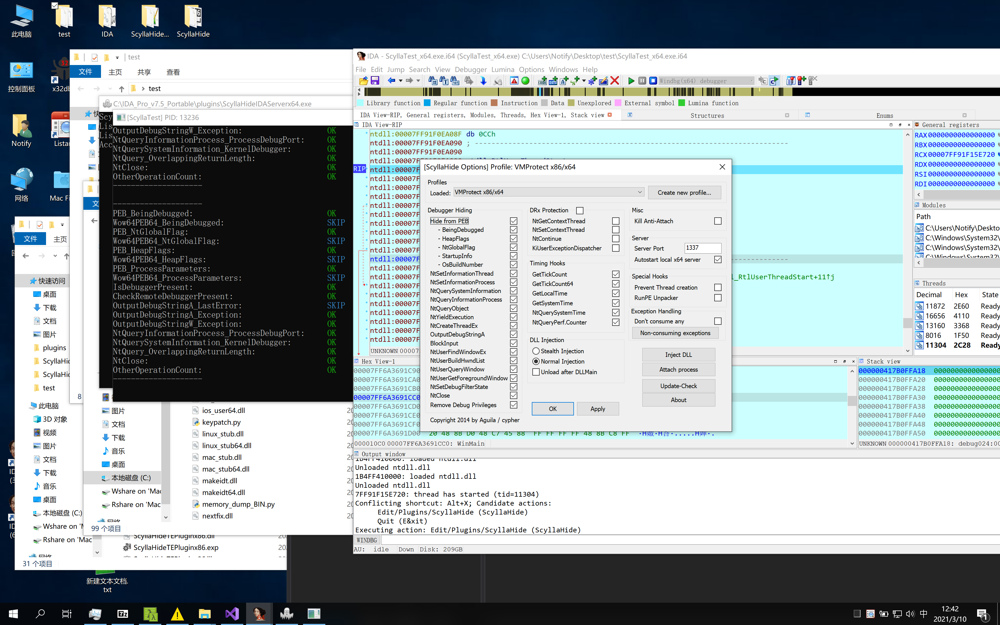

# Hint

支持原项目，谢谢原项目作者，我只是改了改代码，以支持IDA7.5  ( 原本只支持IDA6.8 )。我觉得原作者应该会介意。

有事麻烦联系我删除。sorry

Thank you for the original project developer [ScyllaHide](https://github.com/x64dbg/ScyllaHide) Thanks、Thanks、Thanks！！！

only support windows PE. (X86 and X64)

Tips: **in win32 mode, it only support the remote inject.**

32bit (remote inject)

64bit. (remote & native inject)

# Fix

吐血修复，各种bug，不一一列举了

# ScyllaHide - 7.5

ScyllaHide is an advanced open-source x64/x86 user mode Anti-Anti-Debug library. It hooks various functions to hide debugging. This tool is intended to stay in user mode (ring 3). If you need kernel mode (ring 0) Anti-Anti-Debug, please see [TitanHide](https://github.com/mrexodia/titanhide). Forked from [NtQuery/ScyllaHide](https://bitbucket.org/NtQuery/scyllahide).

ScyllaHide supports various debuggers through plugins:

- OllyDbg [v1](http://www.ollydbg.de) and [v2](http://www.ollydbg.de/version2.html)
- [x64dbg](https://x64dbg.com)
- [Hex-Rays IDA](https://www.hex-rays.com/products/ida/) v6 (not supported)
- TitanEngine v2 ([original](http://www.reversinglabs.com/open-source/titanengine.html) and [updated](https://github.com/x64dbg/TitanEngine/) versions)

PE x64 debugging is fully supported with plugins for x64dbg and IDA.

Please note that ScyllaHide is not limited to these debuggers. You can use the standalone command line version of ScyllaHide. You can inject ScyllaHide into any process debugged by any debugger.

More information is available in the [documentation](https://github.com/x64dbg/ScyllaHide/releases/download/docs-2019-05-17/ScyllaHide.pdf) (PDF).

## License
ScyllaHide is licensed under the [GNU General Public License v3](https://www.gnu.org/licenses/gpl-3.0.en.html).

## Special thanks to
- What for his [POISON Assembler source code](https://tuts4you.com/download.php?view.2281)
- waliedassar for his [blog posts](http://waleedassar.blogspot.de)
- Peter Ferrie for his [PDFs](http://pferrie.host22.com)
- MaRKuS-DJM for [Olly Advanced](http://www.openrce.org/downloads/details/241/Olly_Advanced)
- Lim Bio Liong for [MS Spy++ style Window Finder](http://www.codeproject.com/Articles/1698/MS-Spy-style-Window-Finder)

